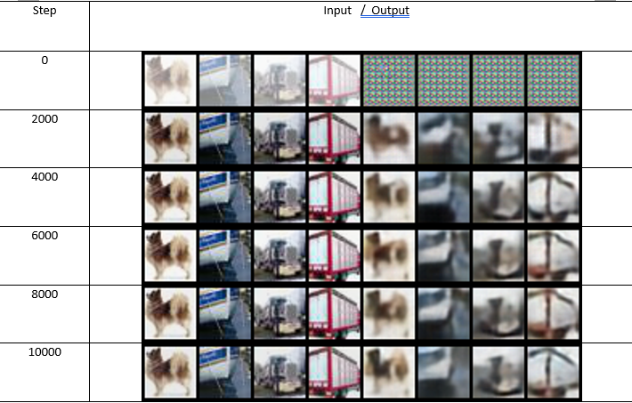

# pytorch-vq-vae
PyTorch Lightning implementation of VQ-VAE by Pham Quang Nhut.

## Requirements

```
$ pip3 install -r requirements.txt
```

## Notebook

See [Colab.ipynb](Colab.ipynb)

## Experiments 

Results on 10k step (Paper's experiment train on 25k step)


